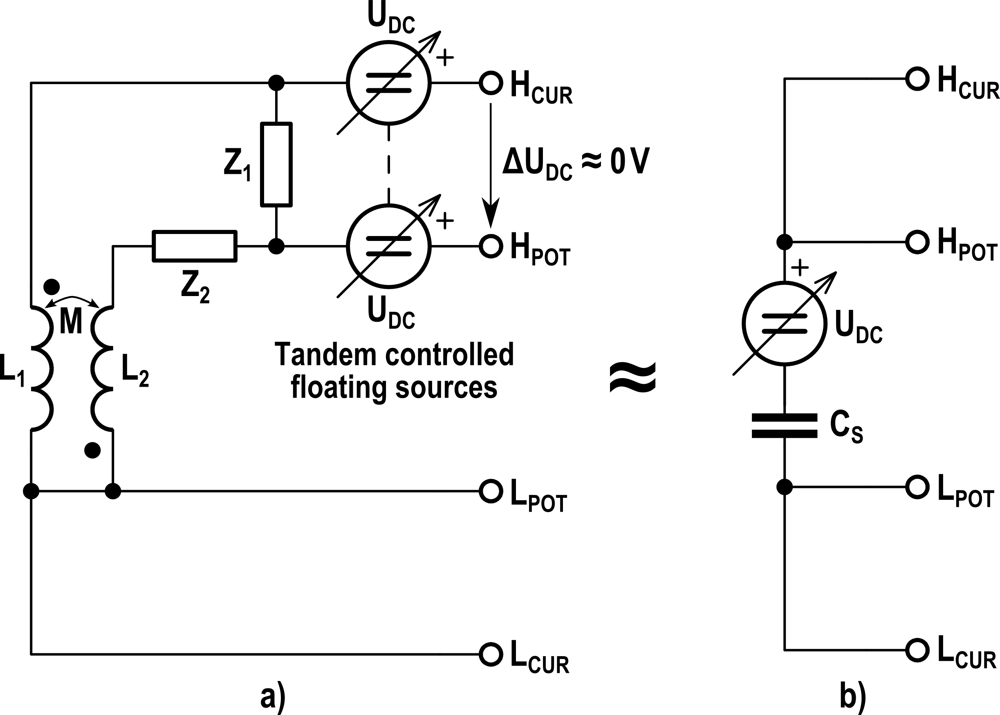
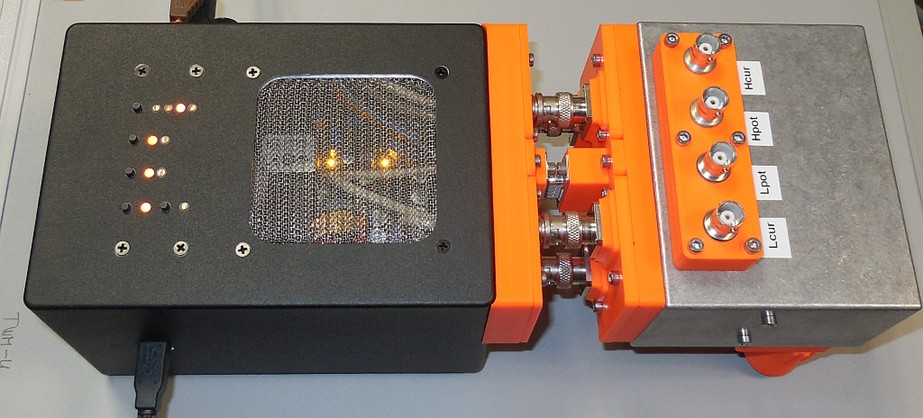

# Capacitive Reactance Simulator Based on Mutual Inductor

This project is simple simulator of capacitive rectance based on a mutual inductor.
It is just a first proof of concept prototype not inteded for directi production/replication.
See DOC for known issues and more details.

## License
The design is distributed under [Cern OHL license V1.2](./cern_ohl_v_1_2.pdf). 

## Acknowledgment
Presented standard design was co-developed in scope of the [EMPIR](http://msu.euramet.org/calls.html) 
project [LiBforSecUse (17IND10)](https://www.ptb.de/empir2018/libforsecuse/home/).
The project received funding from the EMPIR programme co-financed by the Participating States 
and from the European Union's Horizon 2020 research and innovation programme.
